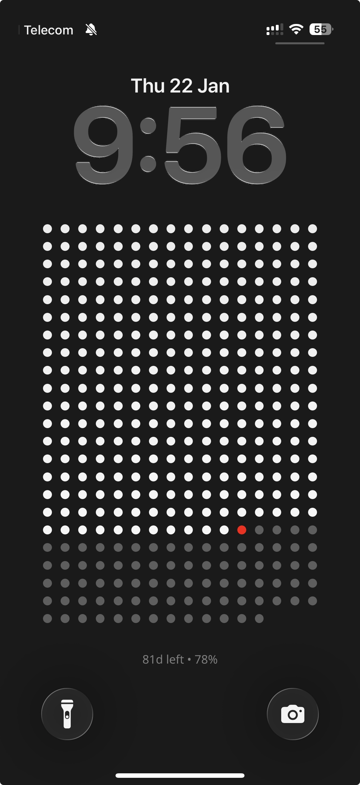
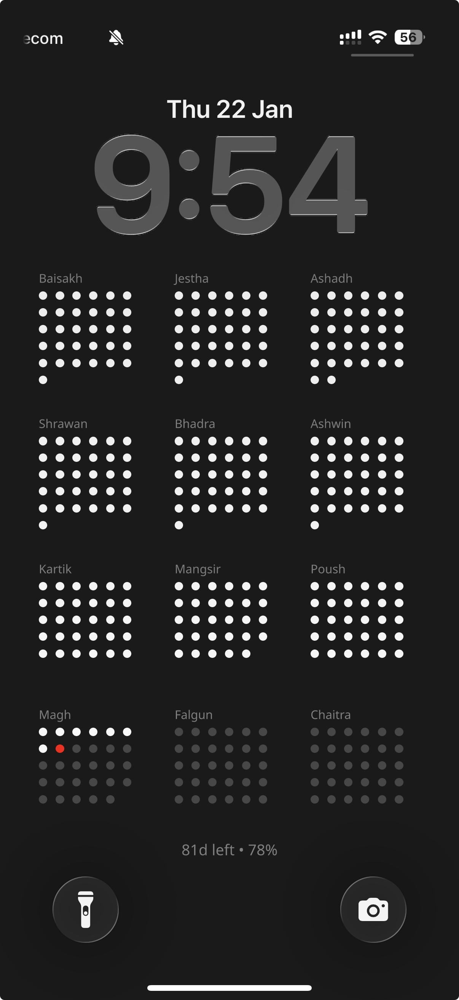

# 🇳🇵 Nepali Year Progress

A minimalist web application and API to visualize your year at a glance. Generate beautiful, dynamic wallpapers for your lock screen that update automatically to show you how much of the Nepali year has passed.

Inspired by [thelifecalendar.com](https://www.thelifecalendar.com).

## Features

- **Dual Visualizations**: Choose between a minimal **Days Grid** or a detailed **Months Grid**.
- **Automated Updates**: Setup guides for iOS (Shortcuts) and Android (MacroDroid) to keep your wallpaper fresh every day.
- **Dynamic Image Generation**: High-quality PNG wallpapers generated on-the-fly via Cloudflare Workers.
- **Device Optimized**: Support for a wide range of iOS and Android screen resolutions.

## Screenshots

|                    Days Grid                     |                     Months Grid                      |
| :----------------------------------------------: | :--------------------------------------------------: |
|  |  |

## Tech Stack

### Backend (API & Image Generation)

- **[Hono](https://hono.dev/)**: Lightweight web framework for Cloudflare Workers.
- **[@cloudflare/pages-plugin-vercel-og](https://developers.cloudflare.com/pages/functions/plugins/vercel-og/)**: For dynamic image generation at the edge.
- **[Cloudflare Workers](https://workers.cloudflare.com/)**: Serverless execution at the edge.
- **TypeScript**: For type-safe development.

### Frontend

- **[React 19](https://react.dev/)**: Latest React features.
- **[Vite](https://vitejs.dev/)**: Fast development environment.
- **[Tailwind CSS v4](https://tailwindcss.com/)**: Modern styling.
- **[Shadcn UI](https://ui.shadcn.com/)**: Beautifully designed accessible components.
- **[Lucide React](https://lucide.dev/)**: Clean and consistent iconography.

## Getting Started

### Local Development

1. **Clone the repository**:

   ```bash
   git clone https://github.com/bimsina/nepali-year-progress
   cd nepali-year-progress
   ```

2. **Install dependencies**:

   ```bash
   pnpm install
   ```

3. **Run the API (Backend)**:

   ```bash
   pnpm run dev
   ```

4. **Run the Frontend**:
   ```bash
   pnpm run dev:client
   ```

The app will be available at `http://localhost:5173` and the API at `http://localhost:8787`.
